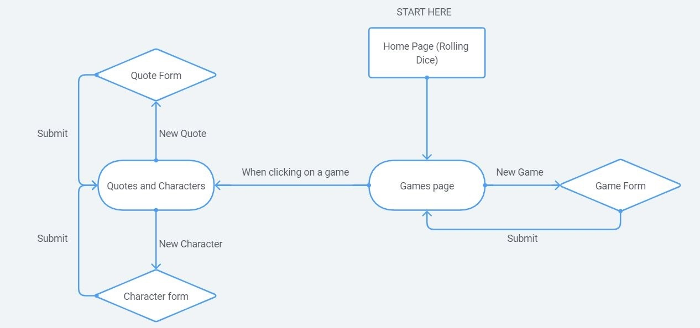

# MVP: Quote-o-meter - Andi Nowë 

The idea of this project is to build a website to store the best quotes and jokes from role-playing games sessions, like D\&D, Vampire, Cyberpunk, etc, in an RPG/8-bit styled app.

## Installation

- Install Node.js for the back end and front end:

```bash
npm install
```
- Install FontAwesome for React for the icon: [FontAwesome](https://fontawesome.com/how-to-use/on-the-web/using-with/react)

- This is the library used for the Css: [RonenNess-RPGUI](https://github.com/RonenNess/RPGUI/blob/master/README.md#what-is-it)

- The back end is built using MYSQL and Express.

- The front end is built with React.

- Back end tested with Postman.

- To create an empty database from scratch we will use this command on the mysql console:

```bash
mysql -u root -p mvp < [C:\Insert here the route of the "init-db.sql" file}
```

## Database schema:


## User flow schema:




## Wanted features

- Select what characters participated in each quote when creating the quote.
- Upvote system for the quotes.
- Order system for the quotes based on the votes.
- Date and time automatically added on the quotes.
- Search bar for quotes and characters.
- Option to add an images on games and character creation.
- Accounts for the players. 
- Re-do the whole css styling. 


## Credits
_This is a student project that was created at
[CodeOp](http://codeop.tech), a full stack development bootcamp in Barcelona._
